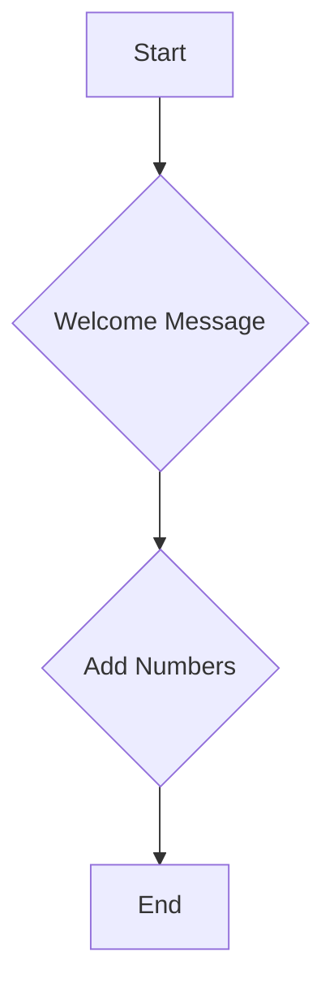

```markdown
# Flow Documentation

## Flow Overview

This document outlines the logic flow of the provided Python code.

## Flowchart



## Step-by-Step Logic Flow

1. **Start**
   - The program begins execution.

2. **Welcome Message**
   - The `welcome_message()` function is called.
   - It prints the string "Hello! This is a test file for the AI Agent."

3. **Add Numbers**
   - The function call is not explicitly shown in the provided code.
   - However, the function `add_numbers(a, b)` is defined and ready to be called with appropriate arguments.

4. **End**
   - The program execution concludes.

## Function Descriptions

### welcome_message()
- **Purpose**: Prints a welcome message to the console.
- **Parameters**: None
- **Return Value**: None

### add_numbers(a, b)
- **Purpose**: Adds two numbers and returns the result.
- **Parameters**:
  - `a` (int or float): The first number to be added.
  - `b` (int or float): The second number to be added.
- **Return Value**: The sum of `a` and `b`.
```

This Markdown file provides a clear and concise overview of the logic flow in the given Python code, including a flowchart and detailed descriptions of each function.